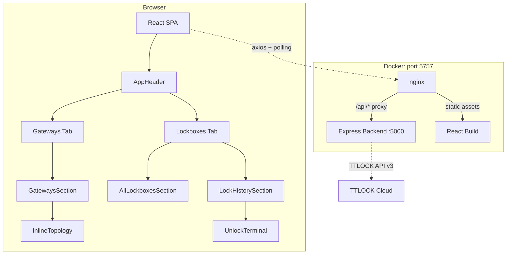
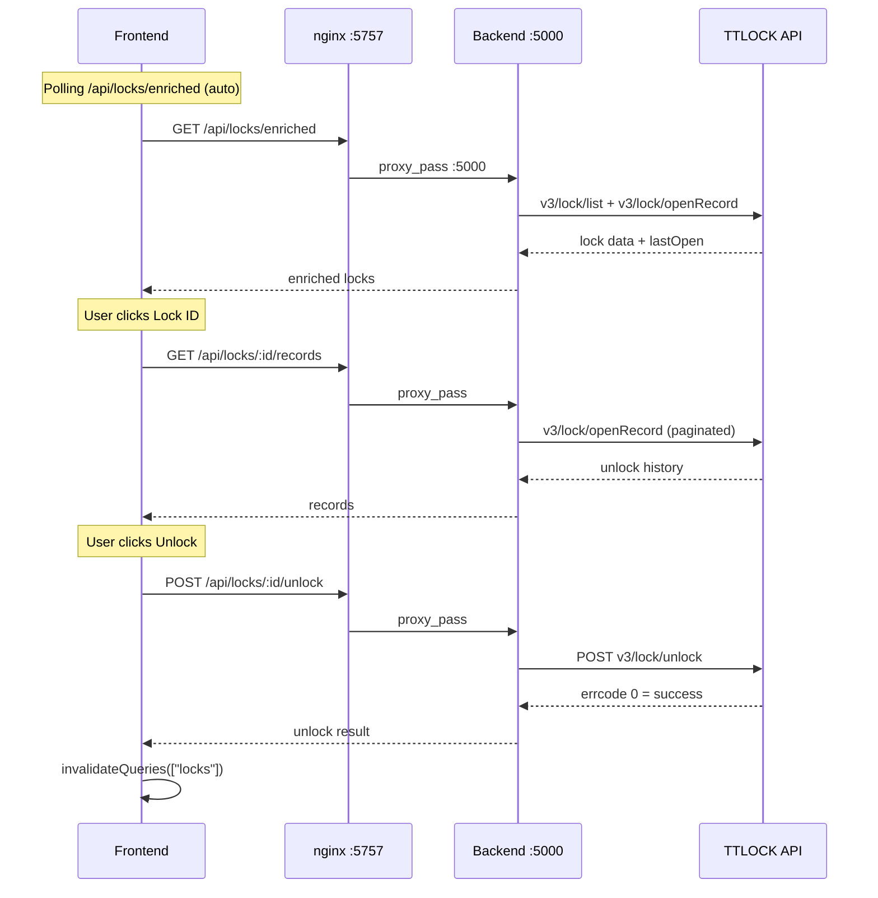
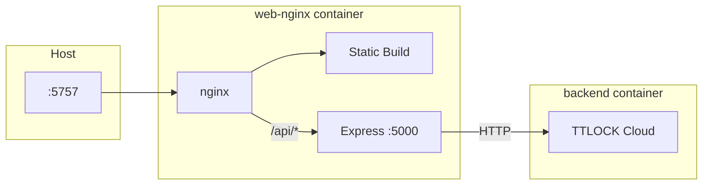
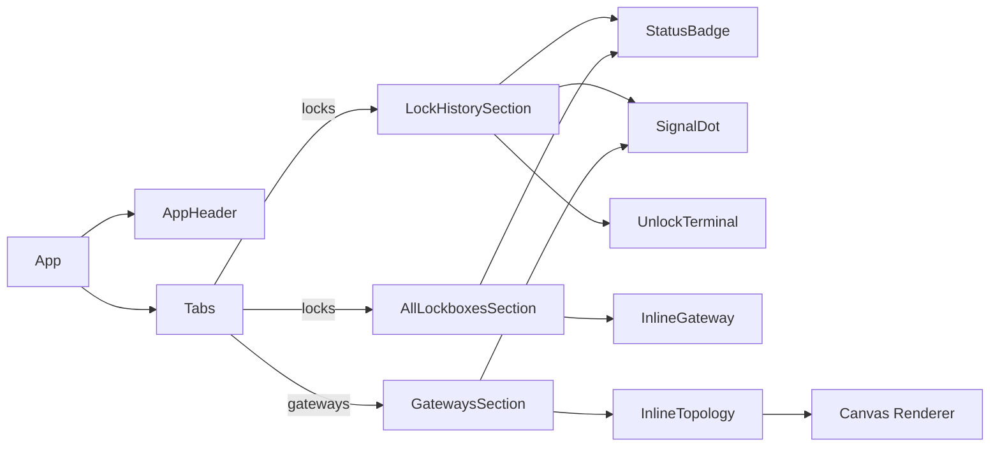

# TTLOCK Dashboard

Web dashboard untuk **monitoring** smart lock TTLOCK (read-only). Menampilkan info lock, riwayat pembukaan, status semua lockbox, dan **topologi gateway** dalam satu halaman.

> **Catatan:** Dashboard ini bersifat **ephemeral** — hanya dijalankan saat dibutuhkan, lalu dihentikan setelah selesai digunakan.

## Architecture



## Data Flow



## Docker Architecture



| Service | CPU Limit | Memory Limit | CPU Reserve | Memory Reserve |
|---------|-----------|-------------|-------------|----------------|
| backend | 2 | 512M | 0.5 | 256M |
| web-nginx | 1 | 256M | 0.25 | 128M |

## Component Tree



## Tech Stack

| Layer | Teknologi |
|---|---|
| Backend | Express.js + TypeScript |
| Frontend | React 19 + Vite 5.4 + TypeScript |
| UI | shadcn/ui + Radix UI + Lucide Icons |
| State | TanStack Query (polling, cache invalidation) |
| Styling | Tailwind CSS 4 |
| Production | nginx (reverse proxy + static) + Node.js |
| API | TTLOCK Open Platform API v3 |

## Features

- **Auto Login** — Otomatis login ke TTLOCK API saat server start
- **Lock History** — Cek riwayat pembukaan berdasarkan Lock ID
- **All Lockboxes** — List semua lockbox dengan last open time (always fresh, no cache)
- **Sortable Table** — Default smart sort: lockbox by gateway-first + last open terbaru, gateways by online-first + WiFi sortable
- **Gateway List** — List semua gateway dengan jumlah lockbox tersambung, status online/offline, expandable lockbox list (tampilkan alias duluan)
- **Gateway Topology** — Visual interaktif (canvas) gateway → lockbox, animasi garis, RSSI per koneksi, refresh 1 detik, drag/pan/zoom
- **Inline Topology** — Topologi inline di bawah tabel, bukan modal overlay
- **Unlock Terminal** — Remote unlock via gateway (TTLOCK API v3)
- **WiFi Signal Icons** — Icon WiFi berdasarkan kekuatan sinyal (Strong/Medium/Weak)
- **Smart Pagination** — Pagination efisien untuk ribuan records

## Prerequisites

- Node.js 18+ (development) / Node.js 22 (Docker)
- npm
- Docker & Docker Compose (untuk production)
- Akun TTLOCK developer (client_id, client_secret)
- Akun TTLOCK APP (username, password MD5)

## Setup

### Development (2 terminal)

```bash
git clone https://github.com/helmipradita/ttlock-dashboard.git
cd ttlock-dashboard

# Terminal 1: Backend
cd backend
cp .env.example .env   # Isi credential TTLOCK
npm install
npm run dev            # http://localhost:5757

# Terminal 2: Frontend
cd web
npm install
npm run dev            # http://localhost:5173 (proxy /api → :5757)
```

### Docker (production)

```bash
git clone https://github.com/helmipradita/ttlock-dashboard.git
cd ttlock-dashboard

# Setup env
cp backend/.env.example backend/.env   # Isi credential TTLock

# Build & run (nginx expose port 5757)
docker compose up -d --build

# Buka browser
# http://localhost:5757
```

**Rebuild per-service:**
```bash
docker compose up -d --build web-nginx   # frontend only
docker compose up -d --build backend     # backend only
docker compose up -d --build             # both
```

## API Endpoints

| Endpoint | Method | Description |
|---|---|---|
| `/api/auth/status` | GET | Status autentikasi |
| `/api/locks/enriched` | GET | List semua lockbox + last open (always fresh) |
| `/api/locks` | GET | List semua lockbox (raw) |
| `/api/locks/:lockId` | GET | Detail lockbox |
| `/api/locks/:lockId/records` | GET | Riwayat pembukaan (paginated) |
| `/api/locks/:lockId/gateway` | GET | Info gateway lockbox |
| `/api/locks/:lockId/unlock` | POST | Remote unlock via gateway |
| `/api/locks/:lockId/passcode` | POST | Generate offline One-Time Passcode (6 jam) |
| `/api/gateways` | GET | List semua gateway |
| `/api/gateways/:gatewayId/topology` | GET | Topologi gateway + lockbox (cached 5s, single-flight) |

## RSSI & WiFi Signal

| Threshold | Label | Icon | Color |
|---|---|---|---|
| > -75 | Strong | `WifiHigh` | Green |
| -75 .. -85 | Medium | `Wifi` | Amber |
| < -85 | Weak | `WifiLow` | Red |
| null | Unknown | `WifiZero` | Gray |
| Disconnected | — | `WifiOff` | Gray |

Helper: `wifiIconForRssi()` dan `wifiIconForOnline()` di `status.tsx`.

## Project Structure

```
TTLOCK/
├── docker-compose.yml
├── Dockerfile.backend
├── Dockerfile.web
├── nginx/nginx.conf
├── README.md
├── AGENTS.md
├── backend/
│   ├── package.json
│   ├── tsconfig.json
│   ├── .env.example
│   └── src/
│       ├── main.ts              # Express entry + TTLock init
│       ├── config.ts            # Env loader
│       ├── services/
│       │   └── ttlock.service.ts
│       └── routes/
│           └── ttlock.routes.ts
└── web/
    ├── vite.config.ts
    ├── components.json
    └── src/
        ├── main.tsx
        ├── App.tsx              # Tabs: Lockboxes + Gateways
        ├── api/                 # Typed API client + types
        ├── components/
        │   ├── layout/          # AppHeader
        │   ├── ui/              # shadcn/ui primitives
        │   ├── status.tsx       # StatusBadge + SignalDot + wifi helpers
        │   ├── LockHistorySection.tsx
        │   ├── AllLockboxesSection.tsx
        │   ├── GatewaysSection.tsx
        │   └── InlineTopology.tsx
        ├── hooks/
        ├── lib/                 # format.ts, utils.ts
        └── topology/
            └── topology-canvas.ts  # Canvas renderer
```

## Environment Variables

```env
CLIENT_ID=your_app_id           # Dari TTLOCK developer portal
CLIENT_SECRET=your_app_secret   # Dari TTLOCK developer portal
USERNAME=your_ttlock_email      # Akun TTLock APP (email)
PASSWORD=your_md5_password      # Password dalam MD5 hash
PORT=5757                       # Default backend port (Docker override ke 5000)
```

## Deployment Notes

- Dashboard bersifat **temporary** — `docker compose down` setelah selesai
- **Jangan sentuh ngrok** jika ada process yang berjalan
- Credential di `backend/.env` rahasia — jangan commit

## License

MIT
