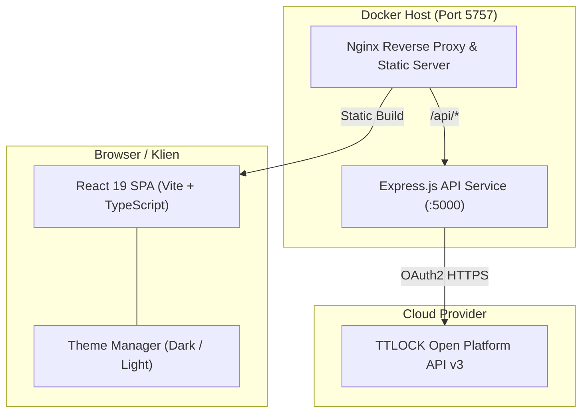

# TTLOCK Dashboard

Aplikasi web modern untuk **pemantauan (monitoring) dan pengelolaan** perangkat Smart Lock & Gateway TTLOCK. Menampilkan informasi status lockbox secara realtime, riwayat pembukaan, visualisasi topologi gateway interaktif, pembuatan PIN offline, dan pembukaan kunci jarak jauh dalam satu antarmuka yang responsif.

[](LICENSE)
[](docker-compose.yml)
[](https://hub.docker.com/u/helmipradita)
[](web/)
[](backend/)
[](web/tsconfig.json)

---

## 📑 Daftar Isi

- [Fitur Utama](#-fitur-utama)
- [Arsitektur Singkat](#-arsitektur-singkat)
- [Panduan Memulai Cepat (Quick Start)](#-panduan-memulai-cepat-quick-start)
- [Dokumentasi Lengkap](#-dokumentasi-lengkap)
- [Daftar Endpoint API](#-daftar-endpoint-api)
- [Lisensi](#-lisensi)

---

## ✨ Fitur Utama

- 🔑 **Offline One-Time Passcode**: Pembuatan PIN satu kali pakai secara instan (berlaku 6 jam) berbasis algoritma sinkronisasi waktu TTLOCK tanpa membutuhkan koneksi gateway internet.
- 🔓 **Remote Unlock**: Perintah buka kunci jarak jauh secara instan melalui Gateway WiFi yang terhubung.
- 🌐 **Interactive Gateway Topology**: Visualisasi grafis hubungan Gateway $\leftrightarrow$ Lockbox dengan indikator kekuatan sinyal (RSSI), animasi realtime, dan kanvas interaktif (pan, zoom, drag).
- 🔍 **Pencarian Cerdas & Autocomplete**: Pencarian cepat instan dengan dropdown interaktif berdasarkan Lock ID, Nama Lockbox, dan Alias Lockbox.
- 🌓 **Dark & Light Mode**: Deteksi otomatis tema sistem operasi (OS) pengguna dengan tombol pengubah mode manual dan persistensi penyimpanan.
- 📊 **Tabel Interaktif Multi-Sorting**: Pengurutan cerdas tabel Lockbox dan Gateway berdasarkan status online, kekuatan sinyal WiFi, nama alias, dan aktivitas buka terakhir.
- 🔄 **Auto-Token Management**: Manajemen token OAuth2 otomatis dengan pembaruan token (*auto-refresh*) berkala 24 jam sebelum kadaluarsa.

---

## 📐 Arsitektur Singkat



Untuk rincian diagram data flow, sequence diagram, dan component tree lengkap, silakan lihat [Dokumentasi Arsitektur](docs/ARCHITECTURE.md).

---

## 🚀 Panduan Memulai Cepat (Quick Start)

Pilih salah satu metode yang paling sesuai dengan kebutuhan Anda:

### 📦 Opsi 1: Menjalankan Langsung via Docker Hub (Tanpa Clone Source Code)

Cocok bagi pengguna yang hanya ingin langsung menjalankan aplikasi di server atau komputer lokal tanpa meng-compile kode sumber.

1. Buat file `docker-compose.yml` di folder mana saja:
   ```yaml
   services:
     backend:
       image: helmipradita/ttlock-backend:latest
       environment:
         - CLIENT_ID=your_client_id
         - CLIENT_SECRET=your_client_secret
         - USERNAME=your_ttlock_email
         - PASSWORD=your_md5_password
         - PORT=5000
       expose:
         - "5000"
       restart: unless-stopped

     web-nginx:
       image: helmipradita/ttlock-web-nginx:latest
       ports:
         - "5757:5757"
       depends_on:
         - backend
       restart: unless-stopped
   ```
2. Jalankan perintah:
   ```bash
   docker compose up -d
   ```
3. Buka browser di **`http://localhost:5757`**.

👉 **[Lihat Panduan Lengkap Docker Hub / docker run](docs/DEPLOYMENT.md#2-cara-cepat-menjalankan-langsung-via-image-docker-hub-tanpa-clone-source-code)**

---

### 💻 Opsi 2: Menjalankan dari Source Code (Clone Repository)

Cocok bagi pengembang yang ingin memodifikasi atau mengembangkan kode aplikasi.

```bash
# 1. Clone repository
git clone https://github.com/helmipradita/ttlock-dashboard.git
cd ttlock-dashboard

# 2. Siapkan file konfigurasi environment
cp backend/.env.example backend/.env
# Isi CLIENT_ID, CLIENT_SECRET, USERNAME, dan PASSWORD pada backend/.env

# 3. Jalankan aplikasi (Otomatis build di dalam Docker)
docker compose up -d --build

# 4. Buka di browser
# http://localhost:5757
```

> **Tips Build:** Anda **tidak perlu** menjalankan `npm run build` lokal sebelum `docker compose up`, karena Dockerfile sudah menggunakan multi-stage build otomatis.

---

## 📚 Dokumentasi Lengkap

Untuk panduan mendalam dan spesifikasi teknis, kunjungi dokumen di folder `docs/`:

| Dokumen | Deskripsi |
|---|---|
| 📐 [**Arsitektur Sistem**](docs/ARCHITECTURE.md) | Diagram interaksi modul, sequence diagram passcode & unlock, dan arsitektur container. |
| 🛠️ [**Spesifikasi Tech Stack**](docs/TECH_STACK.md) | Rincian lengkap teknologi frontend, backend, UI framework, dan library yang digunakan. |
| 🔌 [**Referensi API**](docs/API_REFERENCE.md) | Kontrak request & response API internal serta pemetaan kode error TTLOCK. |
| 🚀 [**Panduan Deployment**](docs/DEPLOYMENT.md) | Konfigurasi variabel environment, tutorial Docker Hub tanpa clone, alokasi memori container, dan troubleshooting. |
| 🖥️ [**Backend Service**](backend/README.md) | Dokumentasi teknis backend Express.js dan panduan development mandiri. |
| 🌐 [**Frontend Application**](web/README.md) | Dokumentasi teknis frontend React dan struktur komponen antarmuka. |

---

## 🔌 Daftar Endpoint API

| Metode | Endpoint | Deskripsi |
|---|---|---|
| `GET` | `/api/auth/status` | Mengecek status autentikasi OAuth2 token TTLOCK |
| `GET` | `/api/locks/enriched` | Mengambil seluruh daftar lockbox dengan data `lastOpen` realtime |
| `GET` | `/api/locks` | Mengambil seluruh daftar mentah lockbox |
| `GET` | `/api/locks/:lockId` | Mengambil rincian spesifikasi teknis lockbox |
| `GET` | `/api/locks/:lockId/records` | Mengambil log riwayat pembukaan kunci secara paginated |
| `GET` | `/api/locks/:lockId/gateway` | Mengambil info gateway dan sinyal RSSI yang terhubung ke lockbox |
| `POST` | `/api/locks/:lockId/passcode` | **Membuat One-Time Passcode offline (berlaku 6 jam)** |
| `POST` | `/api/locks/:lockId/unlock` | **Mengirim perintah buka kunci jarak jauh via Gateway WiFi** |
| `GET` | `/api/gateways` | Mengambil daftar seluruh Gateway yang terdaftar |
| `GET` | `/api/gateways/:gatewayId/topology` | Mengambil topologi Gateway $\leftrightarrow$ Lockbox (cache 5 detik) |

---

## 📄 Lisensi

Proyek ini didistribusikan di bawah lisensi open source [**MIT License**](LICENSE).

Hak Cipta (c) 2026 Helmi Pradita.
