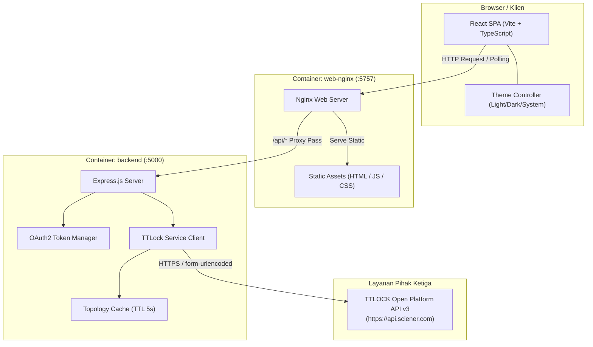
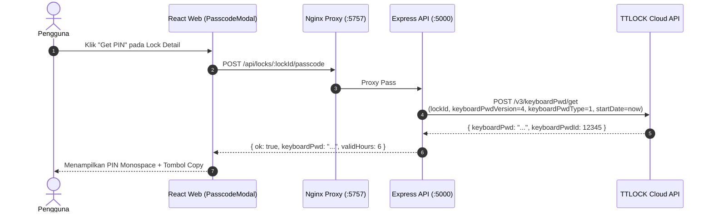
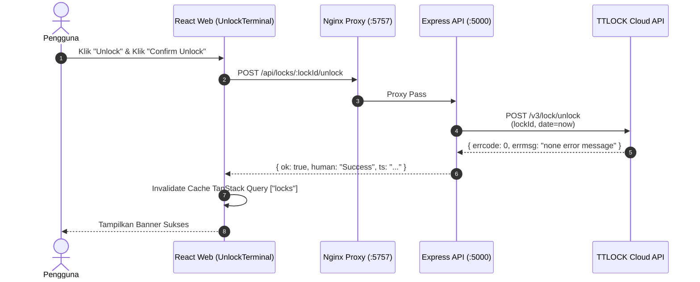
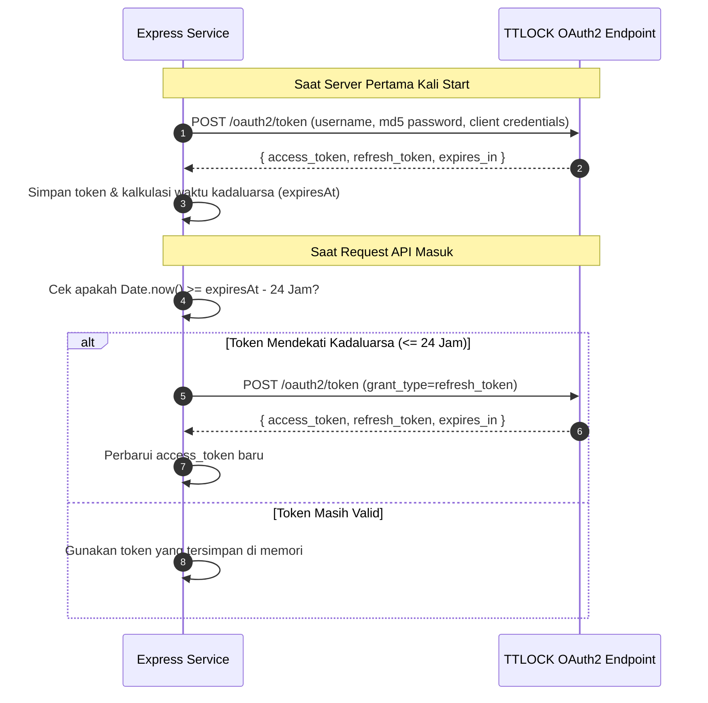
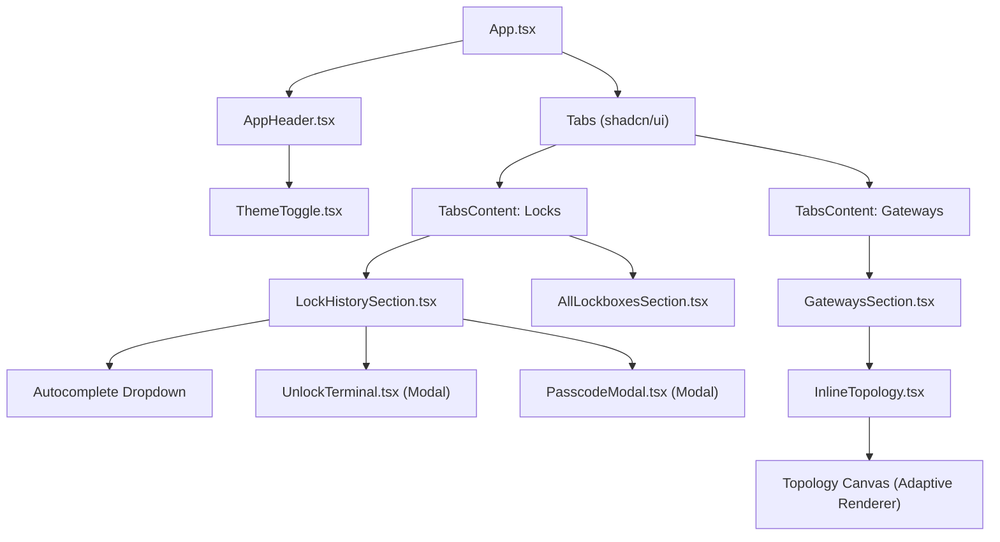

# Arsitektur Sistem TTLOCK Dashboard

Dokumen ini menjelaskan arsitektur perangkat lunak, diagram alur data, hierarki komponen, serta model deployment untuk **TTLOCK Dashboard**.

---

## 1. Diagram Arsitektur Keseluruhan

Aplikasi ini menggunakan pola arsitektur **Single Page Application (SPA)** yang dilayani oleh Nginx sebagai Reverse Proxy dan Static File Server, terhubung ke backend Express.js yang bertindak sebagai jembatan integrasi ke TTLOCK Open Platform API v3.

---

## 2. Diagram Alur Data (Data Flow & Sequences)

### A. Alur Pembuatan Passcode One-Time (Offline PIN)
Passcode dibuat berdasarkan algoritma sinkronisasi waktu antara server TTLOCK dan unit fisik lockbox. **Tidak membutuhkan koneksi gateway internet.**

---

### B. Alur Pembukaan Kunci Jarak Jauh (Remote Unlock)
Membutuhkan lockbox terhubung ke Gateway WiFi yang sedang Online, dan fitur *Remote Unlock* aktif pada aplikasi TTLOCK.

---

### C. Alur Siklus Hidup Autentikasi OAuth2 (Token Lifecycle)

---

## 3. Hierarki Komponen Frontend (Component Tree)

---

## 4. Struktur Layanan Docker

Aplikasi dikemas dalam 2 container ringan:

| Layanan | Image Dasar | Port Internal | Port Publik | Fungsi Utama |
|---|---|---|---|---|
| **`web-nginx`** | `nginx:alpine` | 5757 | **5757** | Melayani aset build React & melakukan reverse proxy `/api/*` ke backend. |
| **`backend`** | `node:22-alpine` | 5000 | *Tidak diekspos langsung* | REST API server, OAuth2 manager, dan TTLOCK client. |
